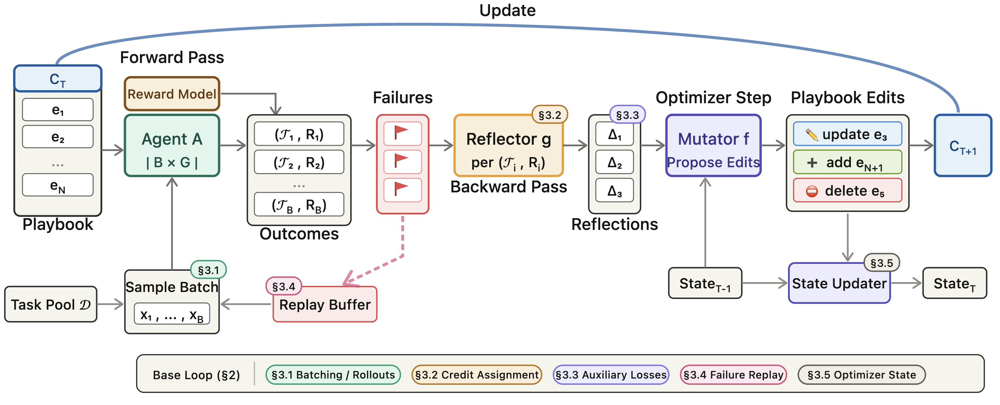

<h1 align="center">Reflective Context Learning</h1>

<p align="center"><b>Studying the Optimization Primitives of Context Space</b></p>

<p align="center">
  <a href="https://arxiv.org/abs/2604.03189"></a>
  <a href="LICENSE"></a>
</p>

<p align="center">
  
</p>

## Overview

Agents that learn from experience — reflecting on failures, updating their instructions, and improving over time — face the same fundamental optimization challenges as classical machine learning: high-variance updates, catastrophic forgetting, local optima, and inefficient credit assignment. Yet in context space, where the learned object is a prompt or playbook rather than model weights, these pathologies are addressed in an ad hoc, fragmented way.

RCL treats context-space adaptation as a first-class optimization problem. It formalizes a reflect-mutate loop — where *reflection* converts execution trajectories into a directional update signal (analogous to gradients) and *mutation* applies that signal to a structured playbook — then systematically extends it with classical optimization primitives: batching for variance reduction, dual-trace credit assignment, auxiliary losses for diagnostic structure, failure replay to prevent forgetting, and optimizer state for momentum. Across AppWorld, BrowseComp+, and RewardBench2, these primitives improve over strong baselines, with their relative importance shifting across task regimes.

## Project Structure

```
rcl/                    # Core RCL framework
  core/                 # Config, optimizer, data structures, interfaces
  components/           # LLM client, inference engines, reflector, mutator
  prompts/              # Prompt templates for reflector/mutator
benchmarks/             # Benchmark adapters
  appworld/             # AppWorld benchmark
  browsecomp/           # BrowseComp+ benchmark
  rewardbench2/         # RewardBench2 benchmark
scripts/                # Training and evaluation entry points
```

## Installation

**Requirements**: Python 3.10+

```bash
git clone https://github.com/nvassilyev/RCL.git
cd RCL
pip install -e .
```

## Supported Models

RCL supports **OpenAI**, **Anthropic**, and **Google Gemini** models out of the box for both the agent and the optimizer (reflector/mutator). Set the API key for whichever provider(s) you want to use:

```bash
# OpenAI (GPT-5, GPT-4o, o3, etc.)
export OPENAI_API_KEY=...

# Anthropic (Claude Opus, Sonnet, Haiku)
export ANTHROPIC_API_KEY=-...

# Google Gemini (API key)
export GEMINI_API_KEY=...
```

Models use `provider/model-name` format:

| Provider | Examples |
|----------|----------|
| OpenAI | `openai/gpt-5.4-nano`, `openai/gpt-4o`, `openai/o3-mini` |
| Anthropic | `anthropic/claude-opus-4-6`, `anthropic/claude-sonnet-4-6`, `anthropic/claude-haiku-4-5` |
| Google | `google/gemini-3-flash-preview`, `google/gemini-3.1-flash-lite-preview` |

## Quick Start

The fastest way to verify your setup is **RewardBench2** — it requires no external servers or datasets beyond what's included in the repo.

### 1. Run an eval (< 1 minute)

```bash
python -m scripts.run_eval \
  --benchmark rewardbench2 \
  --model openai/gpt-5.4-nano \
  --playbook benchmarks/rewardbench2/playbooks/seed_playbook.json \
  --output results/my_first_eval \
  --split test --limit 5 --n-concurrent 5
```

### 2. Run a training loop (~ 5 minutes)

```bash
python -m scripts.run_training \
  --benchmark rewardbench2 \
  --model openai/gpt-5.4-nano \
  --batch-size 5 --n-concurrent 5 --iterations 3
```

This runs the base RCL loop: execute a batch of tasks, reflect on failures, mutate the playbook, repeat. The trained playbook is saved to `results/training/`.

### 3. Evaluate the trained playbook

```bash
python -m scripts.run_eval \
  --benchmark rewardbench2 \
  --model openai/gpt-5.4-nano \
  --playbook results/training/rewardbench2_openai_gpt_5.4_nano/rcl_best.json \
  --output results/my_eval \
  --split test --n-concurrent 16
```

## Training

```bash
python -m scripts.run_training \
  --benchmark {appworld,browsecomp,rewardbench2} \
  --model <agent-model> \
  --reflector-model <reflector-model> \
  --mutator-model <mutator-model> \
  --batch-size 10 --iterations 30
```

The agent model and reflector/mutator models can be from different providers. A common setup is a cheap agent model with a strong optimizer:

```bash
# Cheap agent, strong optimizer (reflector/mutator default to anthropic/claude-opus-4-6)
python -m scripts.run_training \
  --benchmark appworld \
  --model openai/gpt-5.4-nano \
  --batch-size 10 --n-concurrent 10 --iterations 30
```

### Resuming

```bash
python -m scripts.run_training \
  --benchmark appworld \
  --resume results/training/<run_dir>/ \
  --iterations 50
```

## RCL Primitives

Each optimization primitive from the paper can be enabled individually:

```bash
# Failure Replay — replay previously failed tasks to prevent forgetting
--failure-replay-ratio 0.5 \
--failure-replay-passes-to-graduate 3 \
--failure-replay-failures-to-evict 3

# Optimizer State — rolling summary of optimization history
--optimization-state

# Credit Assignment — dual-trace contrastive signal
--dual-trace

# Grouped Rollouts — K rollouts per task for variance reduction
--grouped-rollouts 3

# Batching — reflect on multiple failed traces per iteration
--mini-batch 3

# Auxiliary Losses — enriched reflector with failure attribution + root cause analysis
--auxiliary-losses

# Batched Reflection — reflect on all signal traces in a single LLM call
--batched-reflection
```

All primitives composed:

```bash
python -m scripts.run_training \
  --benchmark rewardbench2 \
  --model openai/gpt-5.4-nano \
  --batch-size 10 --n-concurrent 10 --iterations 30 \
  --failure-replay-ratio 0.5 \
  --optimization-state \
  --dual-trace \
  --grouped-rollouts 3 \
  --mini-batch 3 \
  --auxiliary-losses
```

## Evaluation

```bash
python -m scripts.run_eval \
  --benchmark {appworld,browsecomp,rewardbench2} \
  --model <agent-model> \
  --playbook <path-to-playbook.json> \
  --output <output-dir> \
  --split test --n-concurrent 20
```

For multiple runs (mean +/- std):

```bash
python -m scripts.run_eval \
  --benchmark browsecomp \
  --model openai/gpt-5.4-nano \
  --playbook results/training/bc_run/rcl_best.json \
  --output results/evals/bc_nano \
  --runs 3 --n-concurrent 18
```

## Benchmark Setup

Each benchmark has different infrastructure requirements. See the benchmark READMEs for detailed setup:

| Benchmark | External dependencies | README |
|-----------|----------------------|--------|
| **RewardBench2** | None (data included) | [`benchmarks/rewardbench2/`](benchmarks/rewardbench2/README.md) |
| **AppWorld** | AppWorld server (auto-managed) | [`benchmarks/appworld/`](benchmarks/appworld/README.md) |
| **BrowseComp+** | MCP search server on GPU | [`benchmarks/browsecomp/`](benchmarks/browsecomp/README.md) |

## Adding a New Benchmark

See [`benchmarks/README.md`](benchmarks/README.md) for a step-by-step guide. The framework needs three things:

1. A `SystemAdapter` that runs tasks and returns `ExecutionTrace` objects
2. An `Evaluator` that scores traces
3. A `BenchmarkConfig` describing the domain

## Citation

If you find this work useful, please cite our paper:

```bibtex
@article{rcl2026,
  title={Reflective Context Learning: Studying the Optimization Primitives of Context Space},
  author={Vassilyev, Nikita and Berrios, William and Zhang, Ruowang and Han, Bo and Kiela, Douwe and Mehri, Shikib},
  journal={arXiv preprint arXiv:2604.03189},
  year={2026}
}
```
